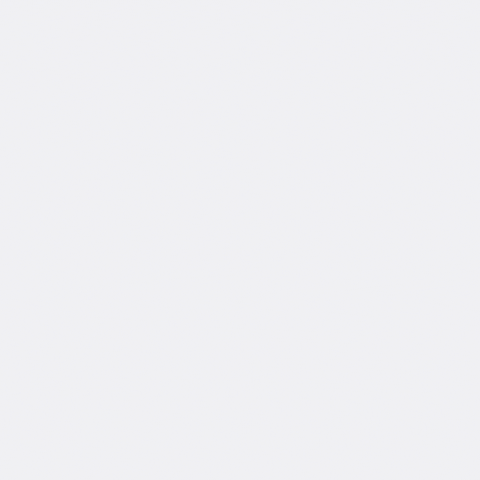

## 👋 Hi, I’m JB from Bangladesh!
### 
- 👀 I’m interested in coding. 🌱 I’m currently Studing B.Sc in Aerospace Engineering and learning different programming languages.
- 📫 How to reach me: 
## GitHub (an other): [@jolok-banarjee](https://github.com/jolok-banarjee) LinkedIn: [JB](https://www.linkedin.com/in/jolok-banarjee-16825b1b7/)

        

 

